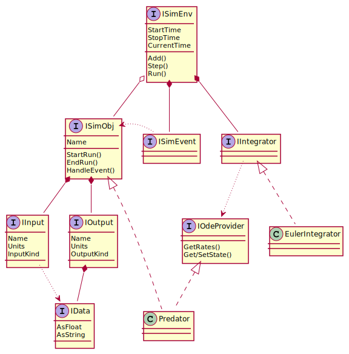
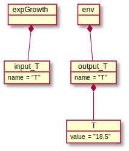
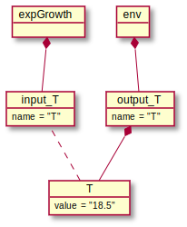
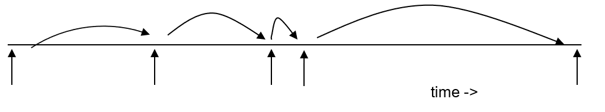
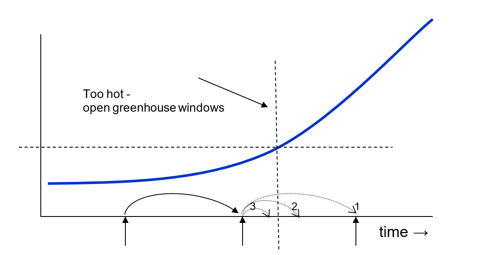
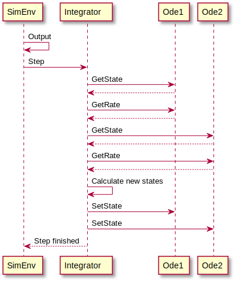

# A brief introduction to modeling and simulation
A system is defined as a group of components, that interact, to perform a particular function. A dynamic system is a system which evolves over time. A system may be  physical (an engine, a farm, an ecosystem) or abstract (a game, a computer program). The formalized representation of our understanding of a system is called a model. Evolving a dynamic model over time is called simulation. For more details, see [Zeigler et al. (2000)](references.md#Zeigler2000)

# The MODCOM framework for simulation

The MODCOM framework for simulation allows the linking of model implementations. MODCOM handles numerical integration, event handling, and communication between component models. MODCOM was first described by Hillyer et al. (2003). It has been used in the EU-funded project SEAMLESS (Van Evert & Lamaker, 2007). It has also provided inspiration for SIMPLACE (Enders et al., 2010; http://www.simplace.net) and BioMa (Donatelli et al., 2012). MODCOM can be considered to be an implementation of the Discrete Event Specification (DEVS) ([Zeigler (1976)](references.md#Zeigler1976), [Zeigler et al. (2000)](references.md#Zeigler2000)).


The concept of MODCOM can be readily understood by considering the UML class diagram in the figure below, which shows the most important classes in the framework. The framework provides a default implementation for each interface. 





## ISimEnv and SimEnv
ISimEnv is the interface that provides the starting point for a simulation. The SimEnv class provides an implementation of ISimEnv.


<div style="background-color:lightgreen">

### Working with the simulation environment <a name="SimEnv"></a>

[Back to top](#Tutorial) |
[View code for this section](https://github.com/nmdcom/NModcom/blob/main/NModcom.ExampleApp/SimEnvOnly.cs).


The first step in creating a MODCOM simulation is setting up the simulation environment. The MODCOM framework provides SimEnv for this, a class that implements ISimEnv. This means that you can set up a simulation by creating an instance of SimEnv. Don't forget to provide a start- and stoptime for the simulation. Once that's done, the simulation can be run by invoking the Run() method.

</div>

```C#
ISimEnv simenv = new SimEnv()
{
    StartTime = 0,
    StopTime = 5
};
simenv.Run();
```

## ISimObj and SimObj

A meaningful simulation needs one or more component models. ISimObj is the interface that defines a component model. SimObj is a class that provides a default implementation of ISimObj. 

ISimObj instances may receive ISimEvent instances via a call to HandleEvent(). An ISimObj is expected to implement model-specific behaviour when it receives an ISimEvent. ISimObj implementations can register new instances of ISimEvent with the ISimEnv where they are registered. The ISimEvent mechanism is therefore suffficient to implement both discrete-event and discrete-time simulations. See also "Time events and the event list" (below).


### Working with a (discrete event) simulation object <a name="SimObj"></a>

[Back to top](#Tutorial) | [View code for this section](https://github.com/nmdcom/NModcom/blob/main/NModcom.ExampleApp/MyFirstSimObj.cs)

> *Working with a (discrete event) simulation object*
> 
>A simulation without any model code is of no use. We want to add at least one model to the simulation. This can be done by writing a class that implements the ISimObj interface, for example by inheriting from the utility class SimObj. This is shown in the code below.
> 
> another paragraph
>
>
> ```
>    internal class MyFirstSimObj : SimObj
>    {
>        [Output("my output")]
>        IData myOutput;
>
>        public override void StartRun()
>        {
>            myOutput = new ConstFloatSimData(3.14);
>        }
>
>        public override void HandleEvent(ISimEvent simEvent)
>        {
>            myOutput.AsFloat += 1.0;
>        }
>
>    }
>
>```

Several points need explaining.
First, the MyFirstSimObj model makes information about its state visible in two steps: by creating a field that implements the IData interface, and by declaring that this field is an output field:

 ```
        [Output("my output")]
        IData myOutput = new ConstFloatSimData(0);
```

Second, the MyFirstSimObj model overrides the StartRun() method declared by the ISimObj interface. StartRun() is called by the SimEnv before each simulation run. This is the right method to assign an initial value to the model's state. Here we create an instance of ConstFloatSimData which can hold a single floating point value.

```
public override void StartRun()
{
        myOutput.AsFloat = 3.14;
}
```

Third, we need to provide a mechanism for the model to change its state. A MODCOM simulation is entirely driven by events. We can make MyFirstSimObj respond to events by implementing HandleEvent() which is declared by ISimObj. 

In the code below, the state (output) of the model is incremented by 1 whenever an event is received. 

*Later we will see how events can be sent at specific times, to specific SimObj's, and how SimObj's can inspect events to determine how to respond*.

```
public override void HandleEvent(ISimEvent simEvent)
{
        myOutput.AsFloat += 1.0;
}
```
Now that we have a model, we can use it in a simulation, simply by using the Add() method of ISimEnv.

```
   ISimEnv simenv = new SimEnv()
   {
       StartTime = 0,
       StopTime = 5
   };

   ISimObj mySimObj = new MyFirstSimObj()
   {
       Name = "Test"
   };

   simenv.Add(mySimObj);
```

The SimEnv maintains a list of SimObj's that have been added to it. We can refer to items in this either by index or by name. The same is true for the list of outputs maintained by a SimObj. That means that the two lines of code below will produce the same output.

```
    Console.WriteLine(simenv[0].Outputs[0].Data.AsFloat);
    Console.WriteLine(simenv["Test"].Outputs["my output"].Data.AsFloat);
```

Only one more thing to do. We need to register one or more events so that our model knows when to update its state.


```
   simenv.RegisterEvent(new TimeEvent(simenv, mySimObj, 0, 0, 1.5 ));
   simenv.RegisterEvent(new TimeEvent(simenv, mySimObj, 0, 0, 3.0 ));
```

When we run this simulation, it produces the following output:

```
[TODO insert output here]
```

### Working with a differential equation simulation object <a name="SimObjODE"></a>


[Back to top](#Tutorial) |
[Code for this section](https://github.com/nmdcom/NModcom/blob/main/NModcom.ExampleApp/DiscreteEvents.cs)


### IData
The interface that defines a data element to be exchanged between ISimObj instances. The outputs of an ISimObj hold an IData instance. The inputs of an ISimObj can hold a pointer to an IData instance. In this way, the output of one ISimObj can be used as in input for one or more other ISimObj instances.

### IIntegrator
Defines the behaviour of numerical integration classes.

### IOdeProvider
When this interface is implemented by a class that also implements ISimObj, it signals that this class (model) requires numerical integration services (it is a "provider" of Ordinary Differential Equations).

### ISimEvent
The  simulation environment maintains a list of objects that implement ISimEvent. This list is sorted by time (and priority, when two ISimEvent instances have the same time). When simulation time reaches the event time of an ISimEvent, appropriate action is taken.

## Data exchange between component models
Component models can exchange data in the form of objects that implement the IData interface. The UML object below illustrates this.

 


In this Figure, expGrowth and env are instances of component models (ISimObj implementations). The env model instance specifies an output with name “T” and makes the data corresponding to that output available via an object called “T”. This object implements the IData interface and is shown in the Figure as holding the value “18.5”. The expGrowth model instance specifies an input, which incidentally has also name “T”. The input object “T” is capable of receiving a pointer to an IData object. 

## Time events and the event list
A MODCOM simulation is driven by time events. Time events are scheduled to occur at a certain time; at that time, the simulation object that is the target of the event is notified. Simulation objects respond by updating their state, and can take into account the kind of event as well as the current time. 

The event list is not fixed: during a simulation new events can be added, while scheduled events can be removed. Thus, an integration object may schedule additional integration events if the time step of numerical integration must be changed; and a farm management object may schedule irrigation events as they become necessary. 



The following C# code snippet shows how to create a time event and add it to the event list:

```
TimeEvent e = new TimeEvent(this, target, time);
simenv.RegisterEvent(e);
```

Events are implemented as classes and thus can encapsulate arbitrary amounts of information. This makes it possible that a crop object responds to “Harvest” events, for example by reducing its biomass; and that a soil object responds to “Tillage” events.

## State events
MODCOM can work with state events. Imagine that the temperature in a greenhouse is rising slowly. When the temperature reaches a certain threshold, windows are opened to slow down or prevent a further rise in temperature. 

This means that as soon as the temperature reaches the threshold, the state of the system must be changed (windows opened). We do not know at which point in time the threshold will be reached. It is most likely that there will be an integration step at the beginning of which the threshold is not yet reached, while at the end of the step the threshold has been exceeded. 

In order to simulate this situation correctly, we must iteratively change the last integration step until we reach precisely the point in time at which the state event occurs; change the state of the system; and continue the simulation. In the figure, the integration step denoted by arrow 1 would result in an overshoot. Halving the time step still results in an overshoot (arrow 2). Halving the time step again results in undershoot (arrow 3). In this example, the final time step will be somewhere between arrows 2 and 3.

Creating and registering a state event is a bit more complicated than creating and registering a time event, because a state event must be linked with an algorithm to determine whether the condition it must detect has occurred.



## Numerical integration in MODCOM
The UML sequence diagram below shows the method calls that are made during one integration step, using the Euler integrator. 

**TODO need more detail on this figure. What is Ode1 Ode2? Why is there only a small output in the left top of the figure? And why is a Step followed?**



## Representation of time in MODCOM
In MODCOM time is always represented as a double precision floating point number. The interpretation of that number is up to the modeler. MODCOM will work correctly whether 0 represents 1 Jan 1970 00:00:00 UTC and the unit of time is a second (Unix-style), or whether 1 represents 1 Jan 1900 (Excel).

MODCOM provides a CalendarTime class which can be used to convert between simulation time and calendar time in a standard way. This class uses .NET DateTime class to represents dates and times with values ranging from 00:00:00 (midnight), January 1, 0001 through 11:59:59 P.M., December 31, 9999.


## Write a simulation with MODCOM

In this example, we use Visual Studio to create a new, empty console application, this gives us the following program:

```
Console.WriteLine("Hello, World!");
```

Add a reference to the NModcom source code in your new project. Then replace the code above with the code below:
```
using NModcom;
ISimEnv simenv = new SimEnv();
simenv.Run();
```
You can compile and run this program but it will not do anything interesting!
 
Now we will create a model that we can add to the simulation. In the solution explorer, right-click on your  project and  select “Add, New item, C# class”. VS will create a new class with name “Class1” – you can rename this to “ExpGrowth” in the solution explorer. Then modify the code in ExpGrowth.cs as shown below (complete code: [ExpGrowth.cs](https://github.com/nmdcom/NModcom/blob/main/NModcom.ExampleApp/ExpGrowth.cs)).

```
using NModcom;
 
namespace ExampleApp
{
    public class ExpGrowth: SimObj, IOdeProvider
    {
    }
}
```
Now we have defined a class which is based on a parent class “SimObj” and which implements the IOdeProvider interface. 
Parent class SimObj is part of the framework and provides a basic implementation of the ISimObj interface. SimObj and classes derived from are able to take part in a simulation, store a name, and keep track of inputs and outputs. Implementing IOdeProvider will allow our new class to use numerical integration.
Right-click on IOdeProvider and then select “Quick Actions and Refactorings | Implement interface”. Do the same for IOdeProvider. Then modify the code as shown below. You have now written a complete MODCOM model for exponential growth!


```
using NModcom;
 
namespace ExampleApp
{
    public class ExpGrowth : SimObj, IOdeProvider
    {
        double rgr = 0.1;
 
        double S = 1;
 
        // This method returns the number of state variables.
        public int GetCount()
        {
            return 1;
        }
 
        // Called by the integrator to obtain rates for all state variables.
        // "deriv" is an array to hold rates upon return.
        // "index" is the index into deriv where the rate for the first state variable
        // should be stored (subsequent rates go in adjacent elements).
        public void GetDerivatives(double[] deriv, int index)
        {
            deriv[index] = S * rgr;
        }
 
        // Called by the integrator to get the current state.
        // The integrator will update the state values and then pass the array
        // to the SetState method.
        // “state" is the array holding the states of all component models
        // “index" is the index into the array where values should be copied.
        public void GetState(double[] state, int index)
        {
            state[index] = S;
        }
 
        // Called by the integrator with the newly calculated state.
        public void SetState(double[] state, int index)
        {
            S = state[index];
        }
    }
}
```
Now we can add the model to simulation environment as shown below. While we are at it, we also add a few lines of code to collect model output. 

```
namespace ExampleApp
{
    class Program
    {
        static void Main(string[] args)
        {
            Console.WriteLine("Hello World!");
            ISimEnv simenv = new SimEnv
            {
                StartTime = 0,
                StopTime = 4
            };
            ISimObj simobj = new ExpGrowth();
            simenv.Add(simobj);
            simenv.OutputEvent += Simenv_OutputEvent;
            simenv.Run();
        }
 
        private static void Simenv_OutputEvent(object sender, EventArgs e)
        {
            ISimEnv simenv = sender as ISimEnv;
            Console.WriteLine("{0}\t{1}"
                 , simenv.CurrentTime
                 , simenv[0].Outputs[0].Data.AsFloat);
        }
    }
}
```

When we run the simulation, it will produce the following output:


```
0       1
1       1.1
2       1.2100000000000002
3       1.3310000000000002
4       1.4641000000000002
```

But there is a problem: if you run the simulation twice, by adding a second line “simenv.Run()” at the end of the main program, it will produce different output! The reason for this is that we have not yet explicitly put our  model in an initial state. The ISimObj interface does provide a mechanism for this: method StartRun() is always called before a simulation starts. if you add the following code to ExpGrowth.cs, the simulation will produce the same output no matter how often it is run.

```
public override void StartRun()
{
    S = 1;
}
```

The input to the exponential growth model consists of an initial state (S=1) and a value for the relative growth rate (rgr=0.1) and is hard-coded. By adding the following two lines to the definition of the ExpGrowth class, we define an input to the model that is visible from the outside.


```
[Input("rgr")]
IData rgr_in;
```
We use this input in StartRun() to initialize the model’s state variable. The complete ExpGrowth class is shown below.

```
public class ExpGrowth : SimObj, IOdeProvider
{
    [Input("rgr")]
    IData rgr_in;
 
    [Input("T")]
    IData temperature;
 
    double rgr = 0.1;
 
    [Output("S")]
    double S = 1;
 
    public int GetCount()
    {
        return 1;
    }
 
    public void GetDerivatives(double[] deriv, int index)
    {
        double f;
        double t = temperature.AsFloat;
        if (t <= 5)
            f = 0;
        else if (t >= 20)
            f = 1;
        else
            f = (t - 5)/15;
        deriv[index] = S * rgr * f;
    }
 
    public void GetState(double[] state, int index)
    {
        state[index] = S;
    }
 
    public void SetState(double[] state, int index)
    {
        S = state[index];
    }
 
    public override void StartRun()
    {
        S = 1;
        if (rgr_in != null)
            rgr = rgr_in.AsFloat;
    }
}
```
We can provide a value for this input in Program.cs as follows:

```
simobj.Inputs["rgr"].Data = new ConstFloatSimData(0.2);
```

## Run a simulation with two component models
TBD

